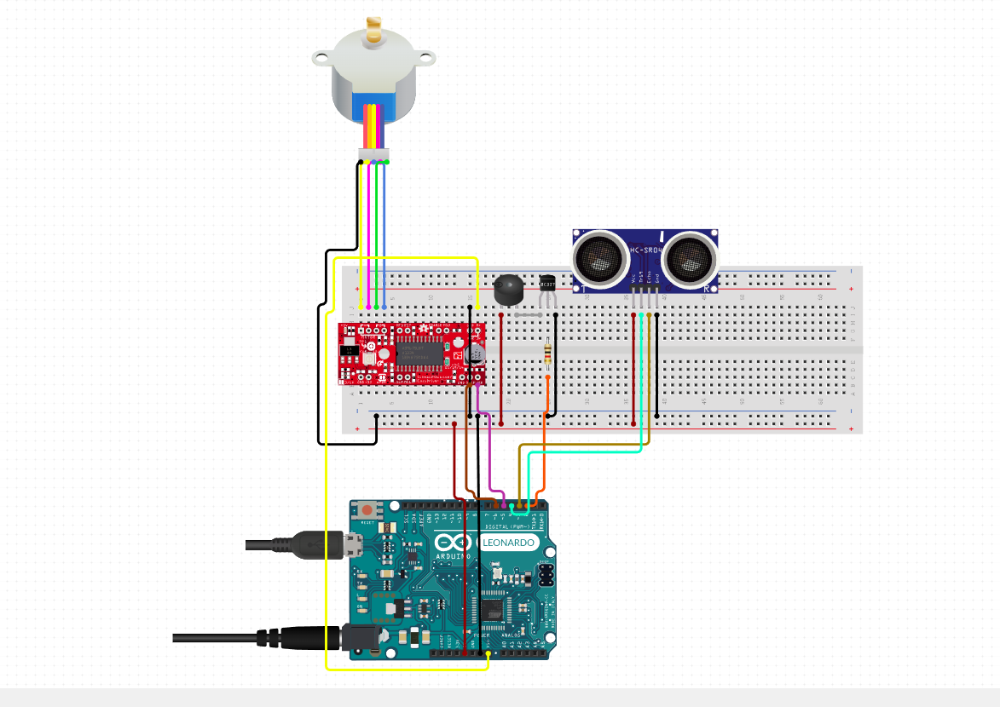

## School Projects
A project for add all school project of Walter.

## Jurassic Park Automata
See a diagram

For source code you can download this [file](jurassic-park-automata/jurassic-park-automata.ino)

## Behavior

1. Ultrasonic sensor read
2. The buzzer is on by 1.5 seconds
3. The door is opened
4. The light is on
5. The buzzer is on by 1.5 seconds
6. The door is closed
7. The light is off
